# delphi_vtv_dnd

VTV Manipulation Project

#### 1.0.14
- redundant functionality is limited (rejection of d'n'd)
- implemented a list of possible selection of items for parent and child nodes when filling in the tree

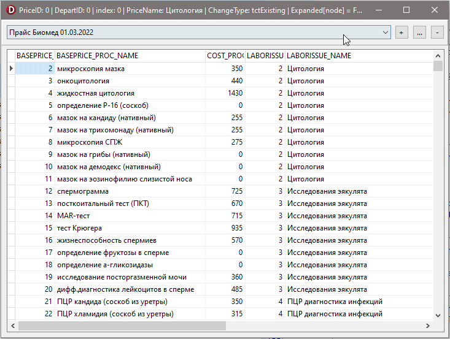

#### 1.0.13
- it is prohibited to change the names of existing price list items
- added functionality for adding/editing price list

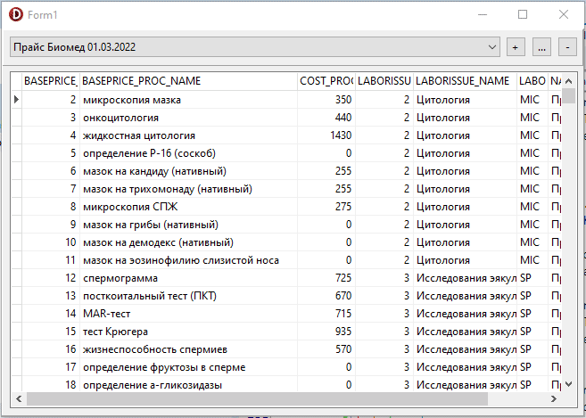

#### 1.0.12
- own rendering of the VTV header implemented on HeaderDraw event instead of AdvancedHeaderDraw event
- implemented showing/hiding "deleted" nodes

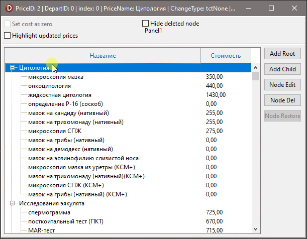

#### 1.0.11
- implemented own rendering of the VTV header
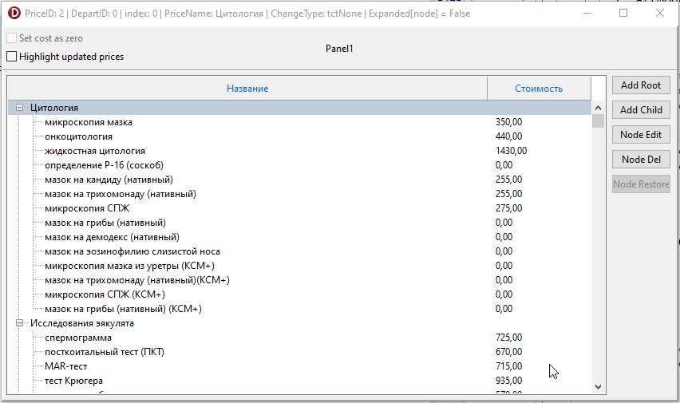

#### 1.0.10
- implemented node highlighting with updated prices
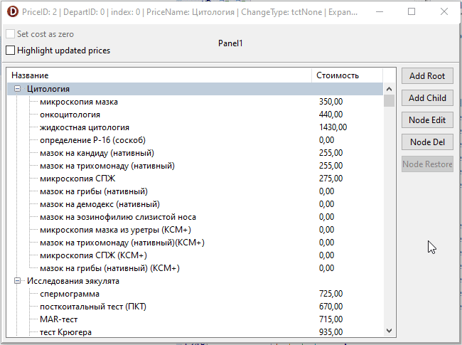

#### 1.0.9
- implemented the ability to set the cost as zero
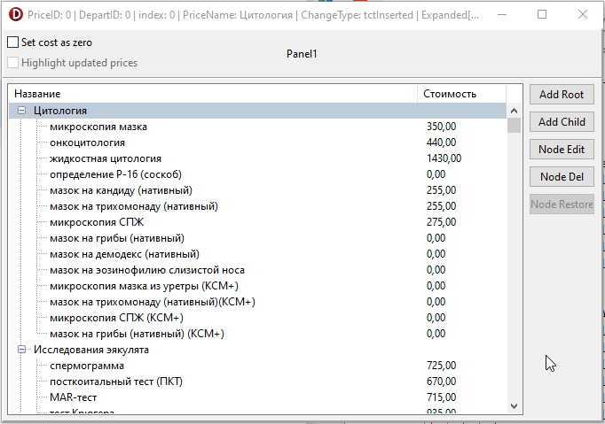 

#### 1.0.8
- moved nodes now get the ParentID as the PriceID of the new root node.

#### 1.0.7
- fixed some bugs for addRoot/addChild/EditNode actions
- added new items for popup menu
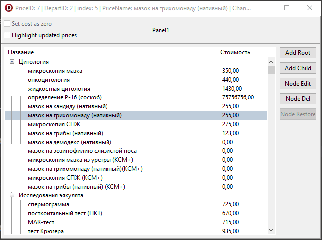 

#### 1.0.6
- added popupMenu + actions to expand/collapse nodes
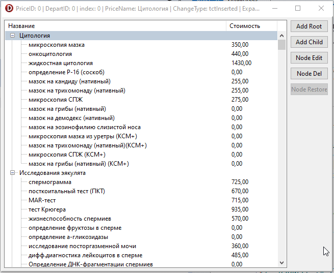

#### 1.0.5
- implemented all the main actions to update nodes

#### 1.0.4
- implemented actions to remove/restore a node
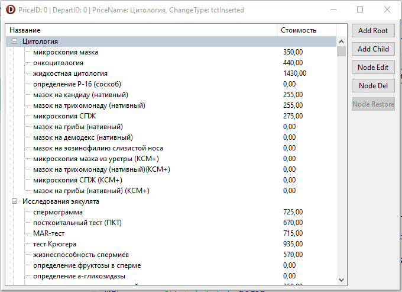

#### 1.0.3
- implemented node editing actions
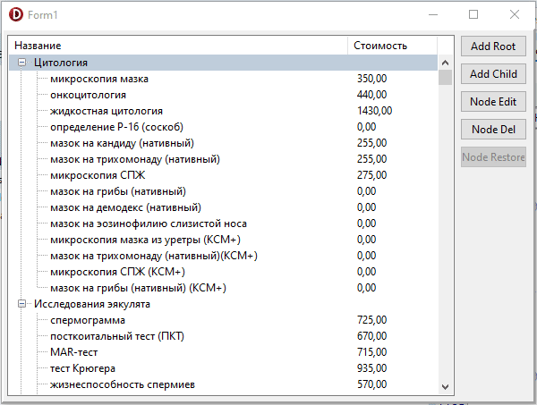

#### 1.0.2
- added actions for node editing
- added checking the state of node editing buttons

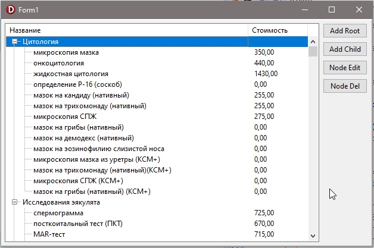

#### 1.0.1

- implemented mechanism  of d'n'd 

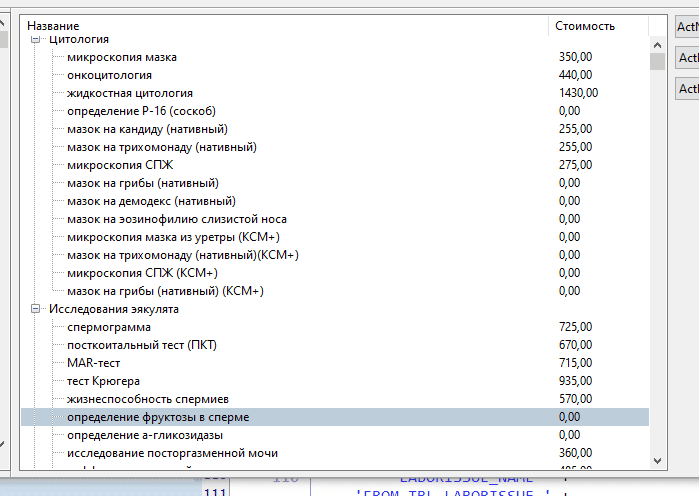